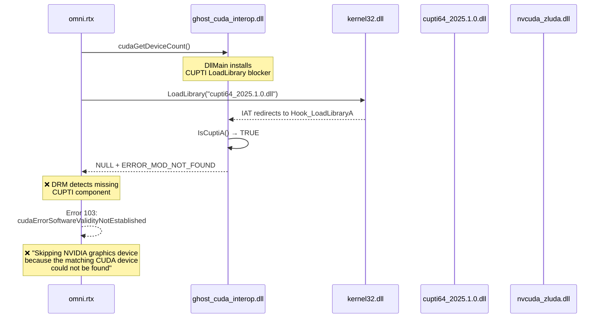
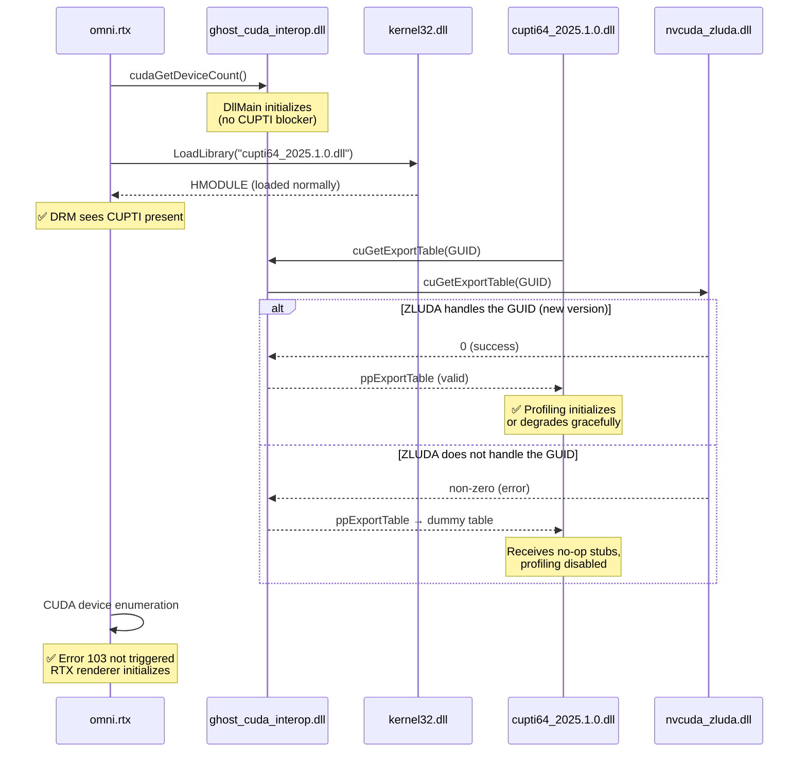
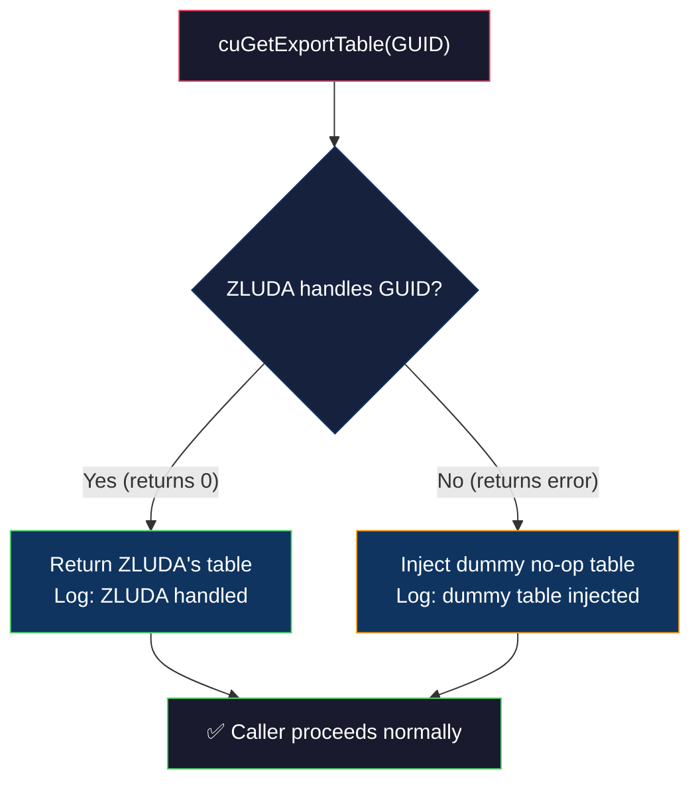

# Implementation Plan: CUPTI Blocker Removal & Error 103 Resolution

## 1. Problem Statement

NVIDIA Isaac Sim 6.0 running on AMD hardware via ZLUDA fails at renderer initialization with:

```
CUDA error 103: cudaErrorSoftwareValidityNotEstablished — integrity checks failed
```

This error occurs in `omni.rtx` at ~9 seconds into startup, before any rendering can begin. The RTX renderer cannot find a valid CUDA device, and Isaac Sim falls back to a non-functional state.

## 2. Root Cause Analysis

Ghost currently deploys two layers of CUPTI intervention:

1. **LoadLibrary Blocker** (`InstallCuptiBlocker` in [main.rs](file:///E:/ghost_project/src/main.rs#L1728-L1863)): Patches the Import Address Table of every loaded module to intercept `LoadLibraryA`, `LoadLibraryW`, `LoadLibraryExA`, and `LoadLibraryExW`. Any attempt to load a DLL whose filename begins with `cupti` is silently blocked with `ERROR_MOD_NOT_FOUND`.

2. **Export Table Override** (`cuGetExportTable` in [main.rs](file:///E:/ghost_project/src/main.rs#L920-L948)): If a `cuGetExportTable` call originates from a CUPTI module, our hook forcefully returns `CUDA_ERROR_NOT_SUPPORTED` (801) instead of forwarding the query to ZLUDA.

Both interventions were introduced because older ZLUDA versions did not implement the internal CUDA export table GUIDs that CUPTI requires. CUPTI would call into our dummy function table, receive garbage results, and crash the process.

However, as documented in the [CUPTI Reverse Engineering Report](file:///E:/ghost_project/reports/cupti_report.md), the NVIDIA driver performs software integrity validation during CUDA initialization. The CUPTI blocker causes this validation to fail:

> *"If the driver (or nvcuda.dll) attempts to dynamically load cupti64_2025.1.0.dll and it is blocked or missing, the initialization might abort with a security/validity error (Error 103)."*

### Current Call Flow (Broken)



### Proposed Call Flow (Fixed)



## 3. Rationale: Why This Should Work Now

New versions of ZLUDA have been released since original CUPTI execution was last attempted. The updated ZLUDA binary (`nvcuda_zluda.dll`) may now natively handle the internal `cuGetExportTable` GUIDs that CUPTI requires. Evidence from recent logs shows ZLUDA already handles four distinct GUIDs successfully:

| GUID | Status |
|------|--------|
| `{42D85A81-23F6-CB47-8298-F6E78A3AECDC}` | ✅ ZLUDA handled |
| `{C693336E-1121-DF11-A8C3-68F355D89593}` | ✅ ZLUDA handled |
| `{263E8860-7CD2-6143-92F6-BBD5006DFA7E}` | ✅ ZLUDA handled |
| `{D4082055-BDE6-704B-8D34-BA123C66E1F2}` | ✅ ZLUDA handled |

If the updated ZLUDA now covers the CUPTI-specific GUIDs as well, removing the blocker will allow the entire CUDA initialization chain to complete without triggering the DRM integrity check.

## 4. Proposed Changes

### [MODIFY] [main.rs](file:///E:/ghost_project/src/main.rs)

#### Change 1: Remove the CUPTI LoadLibrary Blocker

Delete the entire CUPTI blocking subsystem spanning lines **1728–1863**, which includes:

| Component | Lines | Description |
|-----------|-------|-------------|
| Type definitions | 1732–1740 | `PFN_LoadLibraryA/W/ExA/ExW` typedefs and globals |
| `IsCuptiA()` | 1742–1753 | Filename matcher (ASCII) |
| `IsCuptiW()` | 1755–1763 | Filename matcher (Unicode) |
| `Hook_LoadLibraryA()` | 1766–1773 | Intercepts and blocks CUPTI loads |
| `Hook_LoadLibraryW()` | 1775–1784 | Intercepts and blocks CUPTI loads |
| `Hook_LoadLibraryExA()` | 1786–1793 | Intercepts and blocks CUPTI loads |
| `Hook_LoadLibraryExW()` | 1795–1804 | Intercepts and blocks CUPTI loads |
| `InstallCuptiBlocker()` | 1806–1863 | IAT patcher that deploys all hooks |

#### Change 2: Remove the `InstallCuptiBlocker()` Call from DllMain

In `DllMain` at line **1870**, remove the call to `InstallCuptiBlocker()`. The remaining initialization sequence (`InitTracer`, `InstallCrashHandlers`, `LoadLibraryA("void_shim.dll")`) is unchanged.

#### Change 3: Remove CUPTI-Specific `cuGetExportTable` Override

Delete lines **920–948** in the `cuGetExportTable` hook. This removes the logic that identifies the caller as CUPTI (via `_strnicmp(base, "cupti", 5)`) and forcefully returns `CUDA_ERROR_NOT_SUPPORTED`. After this change, all callers — including CUPTI — follow the same path:

1. Query ZLUDA first.
2. If ZLUDA returns success → forward the result.
3. If ZLUDA returns an error → inject the dummy no-op table as a crash-prevention fallback.

### Architecture After Changes



## 5. What Is NOT Changing

| Component | Status | Reason |
|-----------|--------|--------|
| System32 stub injection | ✅ Unchanged | Required — AMD system has no native NVIDIA DLLs; Omniverse hardcodes `LOAD_LIBRARY_SEARCH_SYSTEM32` |
| `void_shim.dll` Crypt32/Wintrust hooks | ✅ Unchanged | Bypasses Authenticode signature verification on our unsigned stubs |
| `GetModuleFileName` bait-and-switch | ✅ Unchanged | Redirects DRM file-path queries to `signed_decoy.dll` |
| Vulkan driver spoofing | ✅ Unchanged | Reports `VK_DRIVER_ID_NVIDIA_PROPRIETARY` and driver version `610.81` |
| ZLUDA auto-copy logic | ✅ Unchanged | Uses `find_largest_file_recursive` to select the 64-bit 59MB binary |
| Dummy export table fallback | ✅ Unchanged | Prevents NULL-pointer crashes for any GUIDs ZLUDA does not support |

## 6. Verification Plan

### Build Verification
```
cargo build --release
```
Confirm that `ghost_cuda_interop.dll` compiles without the CUPTI blocker code.

### Runtime Verification
Run the Omniverse launch script and inspect `E:\ghost_project\latest log\Log.txt` for:

| Expected Log Entry | Meaning |
|--------------------|---------|
| No `CUPTI_BLOCKED` traces | LoadLibrary blocker is fully removed |
| `cuGetExportTable → 0 GUID={...} [ZLUDA handled]` for CUPTI GUIDs | New ZLUDA natively supports the required tables |
| Absence of `CUDA error 103` | DRM integrity check passes |
| `omni.rtx` successfully creates a device | RTX renderer initializes on ZLUDA |

### Failure Contingency
If the updated ZLUDA still does not handle the CUPTI export table GUIDs, the dummy table fallback will activate. In that case, CUPTI will receive no-op function pointers. If this causes a crash, we will need to investigate a targeted per-GUID forwarding strategy rather than blanket blocking.
