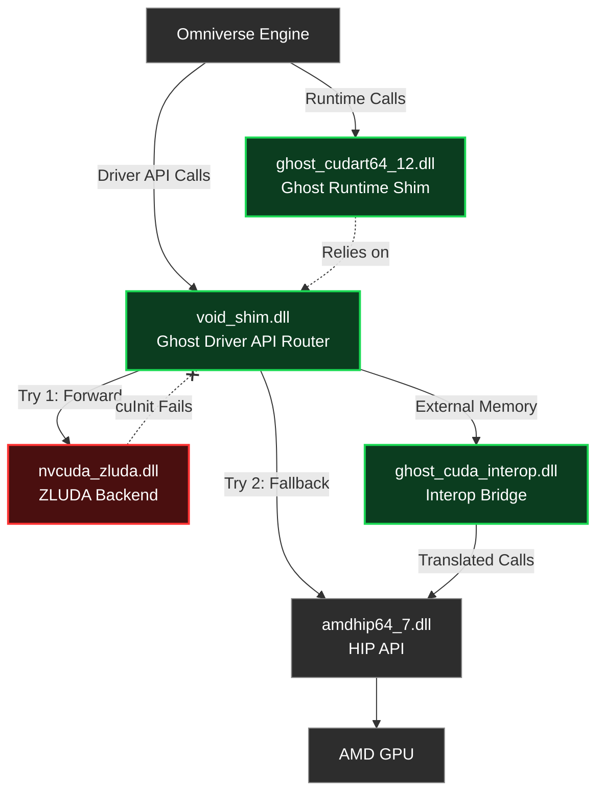

# CUDA Runtime & Initialization Implementation Plan

## Problem Statement

During the startup phase of Omniverse Isaac Sim, the engine experiences deep initialization failures when attempting to interact with the CUDA driver and runtime layers. The data flow leading to the crashes involves two primary error chains:

1. **`ZLUDA_MISSING:cuInit` (-1):** `warp.dll` successfully resolves functions via our `cuGetProcAddress` router, but later makes a direct DLL import call to `cuInit`. This bypasses the router, hitting ZLUDA directly. ZLUDA attempts to initialize against the physical hardware, fails (due to the lack of an NVIDIA GPU), and returns an error.
2. **CUDA Error 35 (`cudaErrorInsufficientDriver`):** `omni.rtx` dynamically loads `cudart64_12.dll` (which is currently ZLUDA's hybrid runtime). When it queries `cudaGetDeviceCount`, the ZLUDA runtime internally attempts to initialize the driver (`cuInit`), which fails. The runtime misinterprets this initialization failure as an outdated driver version, returning error 35 and causing `omni.rtx` to abort GPU creation.
3. **Vulkan Driver Version Leak:** Omniverse queries `vkGetPhysicalDeviceProperties` and receives the true AMD driver version (`26.06.01`), which fails NVIDIA compatibility checks.

## Research Findings

### ZLUDA Initialization Analysis

| Component | Status |
|-----------|--------|
| `cuInit` (Router) | ✅ **Handled** — Intercepted by `cuGetProcAddress` hook, successfully returns `0`. |
| `cuInit` (Direct Export) | ❌ **Failing** — Falls through to ZLUDA's internal implementation. Returns `-1` when no NVIDIA hardware is present. |
| `cudart64_12.dll` | ❌ **Incompatible** — ZLUDA's runtime relies on successful ZLUDA driver initialization. We cannot control its internal state without source modifications. |

### Vulkan Versioning Standards

- NVIDIA encodes Vulkan driver versions using a bitwise shift format: `(major << 22) | (minor << 14) | (patch << 6)`
- For target driver version `610.74`, the resulting integer is `2,559,737,856`.
- AMD driver version `26.06.01` is currently leaking and breaking compatibility heuristic checks.

> [!IMPORTANT]
> The core issue lies in ZLUDA's inability to initialize on non-NVIDIA hardware when called directly. We must intercept the direct `cuInit` call and establish a valid HIP compute context, and we must completely isolate the CUDA Runtime API (`cudart64_12.dll`) from ZLUDA's internal logic.

## Architecture Data Flow

The following diagram illustrates the proposed path for resolving the CUDA initialization failures:

## Proposed Changes

### Phase 1: Direct cuInit HIP Fallback

#### [MODIFY] main.rs

The exported `cuInit` function must actually establish a compute context rather than blindly returning success. If it returns success without initializing a backend, subsequent memory allocations and kernel launches will crash.

1.  **Implement Fallback Logic:**
    *   Attempt ZLUDA's `cuInit` first (forwarding to `nvcuda_zluda.dll`).
    *   If ZLUDA fails, fall back to direct HIP initialization via `hipInit(0)` from `amdhip64_7.dll`.
    *   Cache the initialization state in a global `g_HipInitialized` flag to prevent duplicate initialization from multiple DLLs.
    *   Return `CUDA_SUCCESS (0)` only if a backend successfully initializes.
2.  **Add Telemetry:** Insert `_ghost_trace` calls at each branch to log the exact return codes of both ZLUDA and HIP initialization attempts.
3.  **Update Headers:** Ensure `HIP_FUNC(hipError_t, hipInit, unsigned int)` is present in the macro declarations.

### Phase 2: CUDA Runtime API Shim

#### [MODIFY] main.rs

We will replace ZLUDA's hybrid runtime entirely to prevent `omni.rtx` from triggering internal ZLUDA errors.

1.  **Generate `ghost_cudart.cpp`:** The orchestrator will dynamically generate a C++ stub that exports the necessary runtime functions.
2.  **Compile to `cudart64_12.dll`:** Compile this stub using MSVC and deploy it alongside Isaac Sim, replacing the ZLUDA runtime copy.
3.  **Implement Core Exports:**
    *   `cudaGetDeviceCount` → Returns 1 device.
    *   `cudaDriverGetVersion` → Returns 12080.
    *   `cudaRuntimeGetVersion` → Returns 12080.
    *   `cudaGetDeviceProperties` → Returns spoofed RTX 2080 Ti properties.
4.  **Implement Safety NOPs:** Provide dummy implementations returning `0` for common runtime functions (e.g., `cudaSetDevice`, `cudaGetLastError`) to prevent unresolved symbol crashes if `omni.rtx` invokes them.

### Phase 3: Vulkan Driver Version Spoofing

#### [MODIFY] main.rs (Vulkan Layer Generation)

1.  **Hook `vkGetPhysicalDeviceProperties` and `vkGetPhysicalDeviceProperties2`:** Intercept these calls in the generated `ghost_vulkan_layer.cpp`.
2.  **Patch Driver Version:** After calling the real AMD driver, overwrite the `driverVersion` field in the properties struct with the calculated NVIDIA format integer `(610 << 22) | (74 << 14) | (0 << 6)`.

### Phase 4: Router Completeness

#### [MODIFY] main.rs

1.  **Update `cuGetProcAddress` Hook:** Add `cuDevicePrimaryCtxRelease` to the routing table to ensure dynamic lookups of this function are correctly forwarded to ZLUDA, rather than falling through to the default `NOP_STUB`.

## Resolved Design Decisions

> [!NOTE]
> **Runtime Shim: Stub Generation (Option A).** We elected to generate a dedicated `ghost_cudart.cpp` stub and compile it into `cudart64_12.dll` rather than intercepting `LoadLibrary` calls. This guarantees total control over the symbols exposed to `omni.rtx` and cleanly decouples the runtime layer from ZLUDA's fragile initialization logic.

> [!NOTE]
> **Initialization Fallback:** We are maintaining ZLUDA as the primary initialization target to preserve maximum compatibility with its internal state machinery, but providing a robust, state-tracked fallback to direct HIP initialization to ensure compute context availability.

## Verification Plan

### Automated Tests
1.  Verify MSVC compilation of `ghost_cudart64_12.dll`.
2.  Execute `ghost_amd.exe` and initiate Isaac Sim via `run --no-tui isaac-sim.newton.bat`.
3.  Parse `ghost_trace.log` to confirm `[cuInit] HIP init returned: 0` is logged.

### Manual Verification
1.  Monitor `latest log\Log.txt` to confirm the absence of `ZLUDA_MISSING:cuInit`.
2.  Verify `CUDA error 35` is no longer emitted by `omni.rtx`.
3.  Confirm the GPU properties table in the Omniverse logs reflects `Driver Version: 610.74` and shows the GPU as `Active`.
4.  Verify `cuDevicePrimaryCtxRelease` routes via `GHOST` instead of `NOP_STUB` in the forensic run report.
